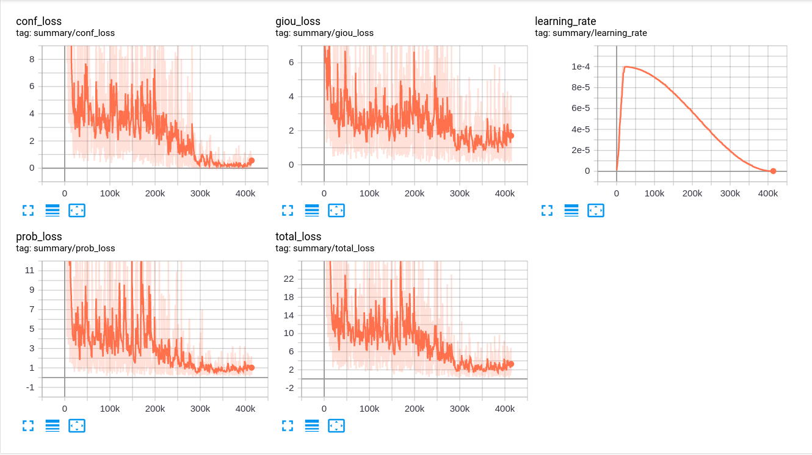

# YOLOv3-Tensorflow
YOLO v3 realize


## Download Dataset
### Pascal Voc 2012
```shell script
$ wget http://host.robots.ox.ac.uk/pascal/VOC/voc2007/VOCtrainval_06-Nov-2007.tar
$ wget http://host.robots.ox.ac.uk/pascal/VOC/voc2012/VOCtrainval_11-May-2012.tar
$ wget http://host.robots.ox.ac.uk/pascal/VOC/voc2007/VOCtest_06-Nov-2007.tar
```
### COCO 2017
```shell script
$ wget http://images.cocodataset.org/annotations/annotations_trainval2017.zip
$ wget http://images.cocodataset.org/zips/train2017.zip
$ wget http://images.cocodataset.org/zips/val2017.zip
```

### pretrained weights
* <https://pan.baidu.com/s/11mwiUy8KotjUVQXqkGGPFQ&shfl=sharepset#list/path=%2F>

## train logs
| |
|:-------:|
|voc_train_logs|

## reference
* https://github.com/YunYang1994/tensorflow-yolov3
* https://github.com/wizyoung/YOLOv3_TensorFlow
